# Tutorial-11
#### Nama: Naufal Ichsan
#### NPM: 2206082013
#### Kelas: Adpro A
---
### Reflection on Hello Minikube

**1. Compare the application logs before and after you exposed it as a Service.**    
Before Exposing Service

After Exposing Service
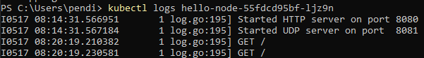
Sebelum mengexpose service dalam log hanya terdapat 2 log yaitu started HTTP server di port 8080 dan started UDP server di port 8081, setelah mengexpose service log menjadi bertambah terdapat request GET / setiap kali kita melakukan reload pada url ```http://127.0.0.1:51358```

**2. Notice that there are two versions of kubectl get invocation during this tutorial section. The first does not have any option, while the latter has -n option with value set to kube-system. What is the purpose of the -n option and why did the output not list the pods/services that you explicitly created?**    
Perbedaan antara kedua sintaks tersebut adalah dalam penggunaan flag -n atau --namespace. Fungsi dari flag ini adalah memfokuskan perintah GET pada namespace yang kita berikan setelah query -n jika ada banyak service berbeda yang memiliki nama yang sama dan tersebar di berbagai namespace.


### Reflection on Rolling Update & Kubernetes Manifest File
**1. What is the difference between Rolling Update and Recreate deployment strategy?**    
Perbedaan utama antara rolling update strategy dan recreate deployment adalah ketika recreate deployment akan ada downtime antara pembaruan aplikasi karena strategi ini memerlukan penghapusan aplikasi sebelumnya terlebih dahulu dan kemudian mendistribusikan ulang aplikasi yang baru. Sementara rolling updates mengubah aplikasi secara langsung ke versi terbarunya tanpa perlu menghapus aplikasi sebelumnya.

**2. Try deploying the Spring Petclinic REST using Recreate deployment strategy and document your attempt.**
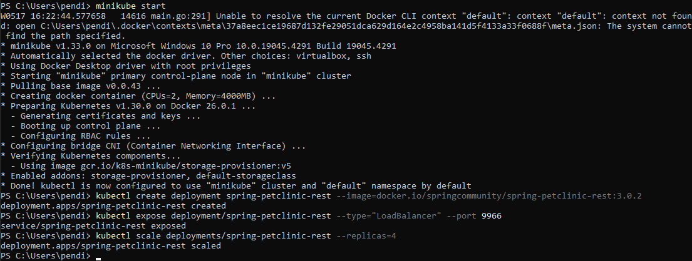
- Reset Minikube dan lakukan recreate deployment dari spring-petclinic-rest:3.0.2
- Expose deployment dan scales replicas sebanyak 4


- Gunakan command berikut untuk mengedit tags dari spring-petclinic-rest deployment melalui teextEditor

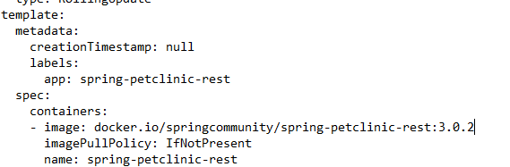
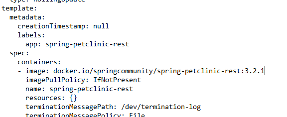
- Ubah image Tag dari spring-petclinic-rest dari 3.0.2 ke 3.2.1 melalui texEditor dan close

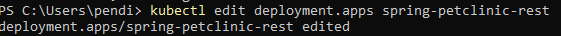
- Setelah mengubah tags melalui textEditor akan ada output seperti gambar diatas

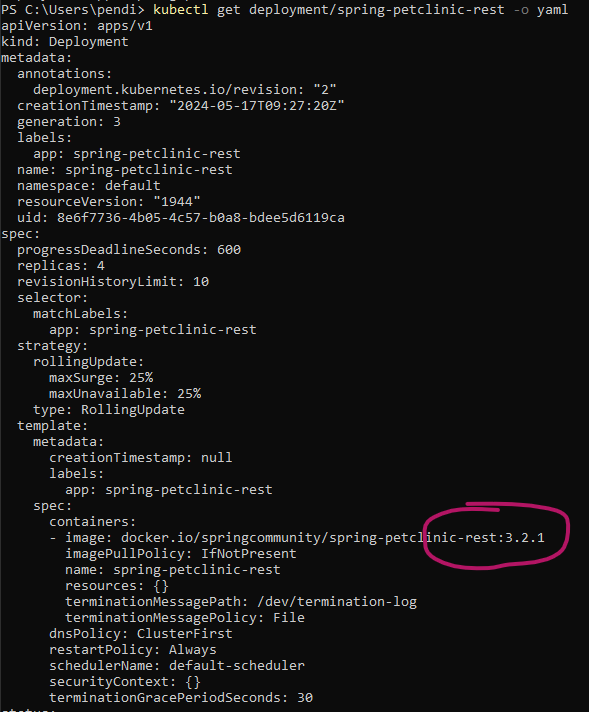
- Lakukan verifikasi bahwa image tag telah berubah dengan command ```kubectl get deployment/spring-petclinic-rest -o yaml```

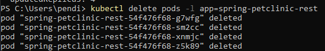
- hapus pod yang ada

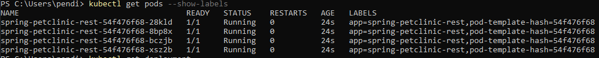
- Dapat dilihat bahwa pod baru telah running menggantikan pod yang sebelumnya dihapus

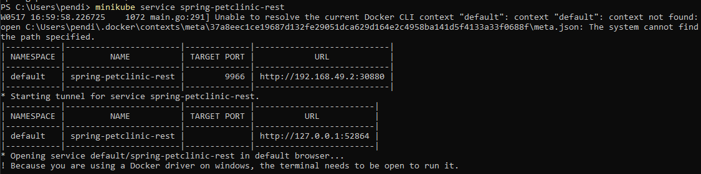
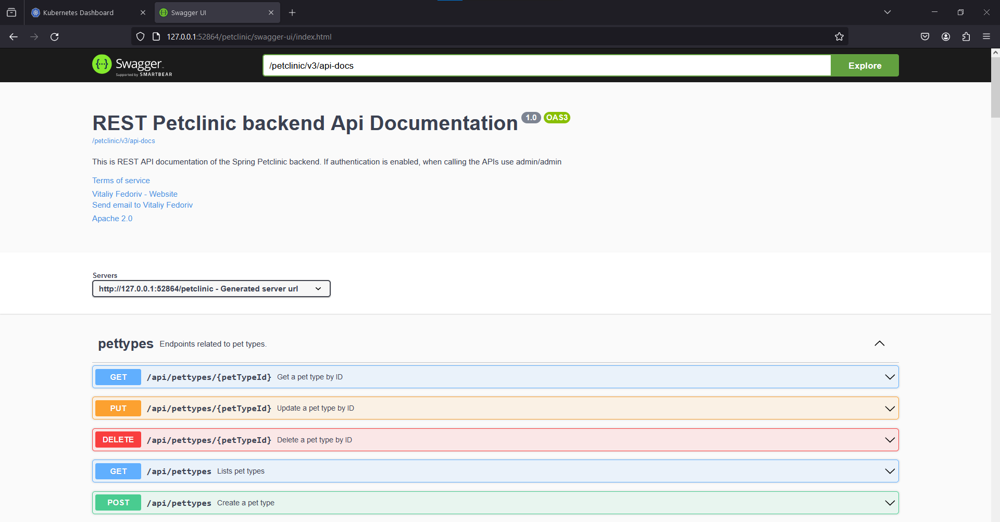
- Tampilan ketika service di run dan url dengan endpoint /petclinic diakses 


**3. Prepare different manifest files for executing Recreate deployment strategy.**   
Buat sebuah file baru seperti yang dilampirkan di dalam github dengan nama deployment2.yaml, Isi dari file tersebut sama seperti file hasil export pada tutorial bagian sebelumnya tapi ada sedikit tambahan yaitu,    
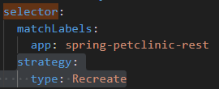

**4. What do you think are the benefits of using Kubernetes manifest files?**    
Manfaat utama menggunakan file manifest adalah efisiensi dan abstraksi. Dengan manifest file, kita tidak perlu lagi mengingat prosedur dan sintaks yang diperlukan untuk melakukan deployment. Penggunaan manifest files juga dapat direuse berulang-ulang sehingga menghemat waktu. Selain itu, penggunaan file manifest juga mengurangi kemungkinan kesalahan manusia, karena service yang dibuat pasti sesuai dengan isi file tersebut, menghindari typo yang mungkin dilakukan oleh programmer jika mengetik sintaks satu per satu.