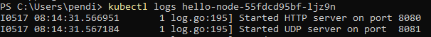

**1. Compare the application logs before and after you exposed it as a Service.**    
Before Exposing Service

After Exposing Service

Sebelum mengexpose service dalam log hanya terdapat 2 log yaitu started HTTP server di port 8080 dan started UDP server di port 8081, setelah mengexpose service log menjadi bertambah terdapat request GET / setiap kali kita melakukan reload pada url ```http://127.0.0.1:51358```

**2. Notice that there are two versions of kubectl get invocation during this tutorial section. The first does not have any option, while the latter has -n option with value set to kube-system. What is the purpose of the -n option and why did the output not list the pods/services that you explicitly created?**    
Perbedaan antara kedua sintaks tersebut adalah dalam penggunaan flag -n atau --namespace. Fungsi dari flag ini adalah memfokuskan perintah GET pada namespace yang kita berikan setelah query -n jika ada banyak service berbeda yang memiliki nama yang sama dan tersebar di berbagai namespace.